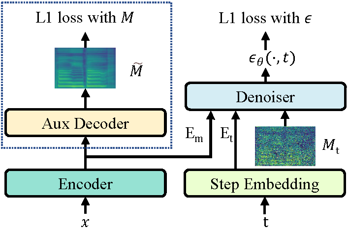
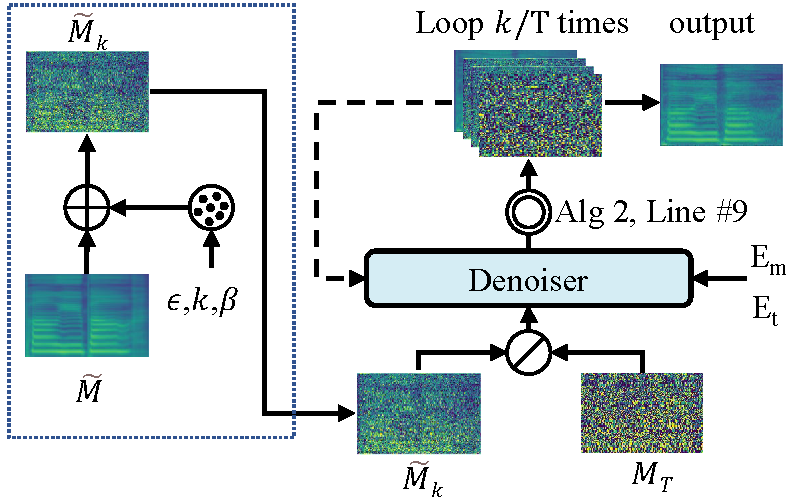
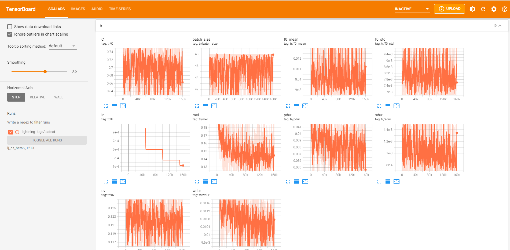

# DiffSinger: Singing Voice Synthesis via Shallow Diffusion Mechanism
[](https://arxiv.org/abs/2105.02446)
[](https://github.com/MoonInTheRiver/DiffSinger)
[](https://github.com/MoonInTheRiver/DiffSinger/releases)
 | [](https://huggingface.co/spaces/NATSpeech/DiffSpeech)

This repository is the official PyTorch implementation of our AAAI-2022 [paper](https://arxiv.org/abs/2105.02446), in which we propose DiffSinger (for Singing-Voice-Synthesis) and DiffSpeech (for Text-to-Speech).
 
<table style="width:100%">
  <tr>
    <th>DiffSinger/DiffSpeech at training</th>
    <th>DiffSinger/DiffSpeech at inference</th>
  </tr>
  <tr>
    <td></td>
    <td></td>
  </tr>
</table>

:tada: :tada: :tada: **Updates**:
 - Mar.2, 2022: [MIDI-new-version](docs/README-SVS-opencpop-e2e.md): A substantial improvement :sparkles:
 - Mar.1, 2022: [NeuralSVB](https://github.com/MoonInTheRiver/NeuralSVB), for singing voice beautifying, has been released  :sparkles:  :sparkles:  :sparkles: .
 - Feb.13, 2022: [NATSpeech](https://github.com/NATSpeech/NATSpeech), the improved code framework, which contains the implementations of DiffSpeech and our NeurIPS-2021 work [PortaSpeech](https://openreview.net/forum?id=xmJsuh8xlq) has been released :sparkles: :sparkles: :sparkles:. 
 - Jan.29, 2022: support [MIDI-old-version](docs/README-SVS-opencpop-cascade.md) SVS. :construction: :pick: :hammer_and_wrench: 
 - Jan.13, 2022: support SVS, release PopCS dataset.
 - Dec.19, 2021: support TTS. [HuggingFace🤗 Demo](https://huggingface.co/spaces/NATSpeech/DiffSpeech)
 
:rocket: **News**: 
 - Feb.24, 2022: Our new work, NeuralSVB was accepted by ACL-2022 [](https://arxiv.org/abs/2202.13277). [Demo Page](https://neuralsvb.github.io).
 - Dec.01, 2021: DiffSinger was accepted by AAAI-2022.
 - Sep.29, 2021: Our recent work `PortaSpeech: Portable and High-Quality Generative Text-to-Speech` was accepted by NeurIPS-2021 [](https://arxiv.org/abs/2109.15166) .
 - May.06, 2021: We submitted DiffSinger to Arxiv [](https://arxiv.org/abs/2105.02446).

## Environments
```sh
conda create -n your_env_name python=3.8
source activate your_env_name 
pip install -r requirements_2080.txt   (GPU 2080Ti, CUDA 10.2)
or pip install -r requirements_3090.txt   (GPU 3090, CUDA 11.4)
```

## Documents
- [Run DiffSpeech (TTS version)](docs/README-TTS.md).
- [Run DiffSinger (SVS version)](docs/README-SVS.md).

## Tensorboard
```sh
tensorboard --logdir_spec exp_name
```
<table style="width:100%">
  <tr>
    <td></td>
  </tr>
</table>

## Audio Demos
Old audio samples can be found in our [demo page](https://diffsinger.github.io/). Audio samples generated by this repository are listed here:

### TTS audio samples
Speech samples (test set of LJSpeech) can be found in [resources/demos_1213](https://github.com/MoonInTheRiver/DiffSinger/blob/master/resources/demos_1213). 

### SVS audio samples
Singing samples (test set of PopCS) can be found in [resources/demos_0112](https://github.com/MoonInTheRiver/DiffSinger/blob/master/resources/demos_0112).

## Citation
    @article{liu2021diffsinger,
      title={Diffsinger: Singing voice synthesis via shallow diffusion mechanism},
      author={Liu, Jinglin and Li, Chengxi and Ren, Yi and Chen, Feiyang and Liu, Peng and Zhao, Zhou},
      journal={arXiv preprint arXiv:2105.02446},
      volume={2},
      year={2021}}


## Acknowledgements
Our codes are based on the following repos:
* [denoising-diffusion-pytorch](https://github.com/lucidrains/denoising-diffusion-pytorch)
* [PyTorch Lightning](https://github.com/PyTorchLightning/pytorch-lightning)
* [ParallelWaveGAN](https://github.com/kan-bayashi/ParallelWaveGAN)
* [HifiGAN](https://github.com/jik876/hifi-gan)
* [espnet](https://github.com/espnet/espnet)
* [DiffWave](https://github.com/lmnt-com/diffwave)

Also thanks [Keon Lee](https://github.com/keonlee9420/DiffSinger) for fast implementation of our work.
