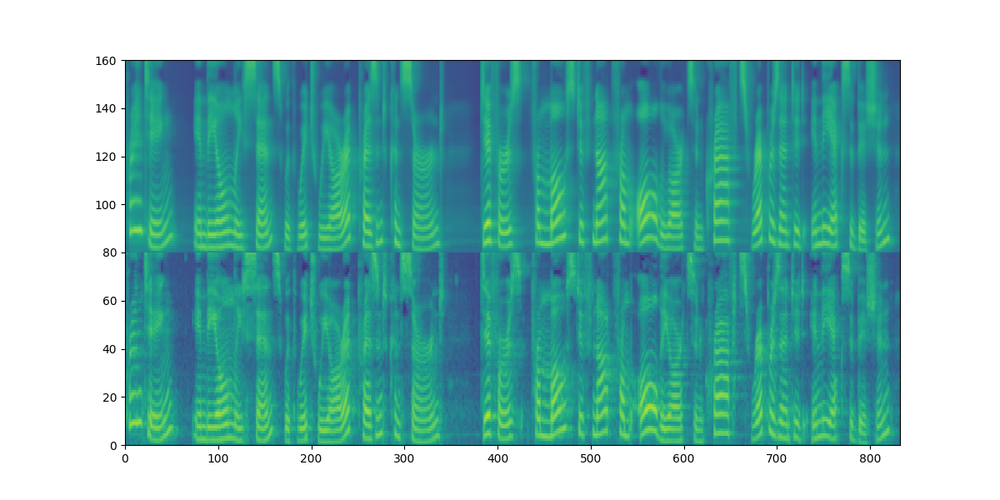
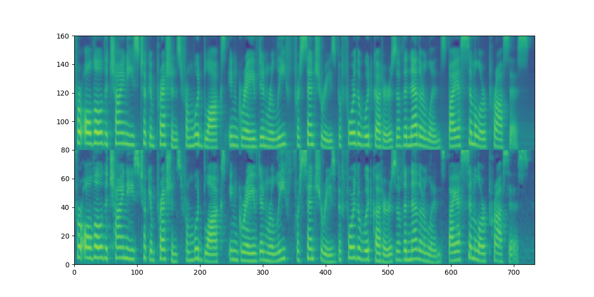
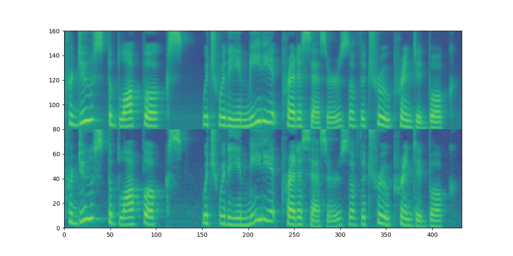

# DiffSinger: Singing Voice Synthesis via Shallow Diffusion Mechanism
[](https://arxiv.org/abs/2105.02446)
[](https://github.com/MoonInTheRiver/DiffSinger)
[](https://github.com/MoonInTheRiver/DiffSinger/releases)

This repository is the official PyTorch implementation of our AAAI-2022 [paper](https://arxiv.org/abs/2105.02446), in which we propose DiffSinger (for Singing-Voice-Synthesis) and DiffSpeech (for Text-to-Speech).
 
<table style="width:100%">
  <tr>
    <th>DiffSinger/DiffSpeech at training</th>
    <th>DiffSinger/DiffSpeech at inference</th>
  </tr>
  <tr>
    <td></td>
    <td></td>
  </tr>
</table>

:tada: :tada: :tada: **Updates**:
 - Feb.13, 2022: [NATSpeech](https://github.com/NATSpeech/NATSpeech), the improved code framework, which contains the implementations of DiffSpeech and our NeurIPS-2021 work [PortaSpeech](https://openreview.net/forum?id=xmJsuh8xlq) has been released :sparkles: :sparkles: :sparkles:. 
 - Jan.29, 2022: support [MIDI](usr/configs/midi/readme.md) version SVS.
 - Jan.13, 2022: support SVS, release PopCS dataset.
 - Dec.19, 2021: support TTS.
 
:rocket: **News**: 
 - Dec.01, 2021: DiffSinger was accepted by AAAI-2022.
 - Sep.29, 2021: Our recent work `PortaSpeech: Portable and High-Quality Generative Text-to-Speech` was accepted by NeurIPS-2021 [](https://arxiv.org/abs/2109.15166) .
 - May.06, 2021: We submitted DiffSinger to Arxiv [](https://arxiv.org/abs/2105.02446).

## Environments
```sh
conda create -n your_env_name python=3.8
source activate your_env_name 
pip install -r requirements_2080.txt   (GPU 2080Ti, CUDA 10.2)
or pip install -r requirements_3090.txt   (GPU 3090, CUDA 11.4)
```

## DiffSpeech (TTS version)
### 1. Data Preparation

a) Download and extract the [LJ Speech dataset](https://keithito.com/LJ-Speech-Dataset/), then create a link to the dataset folder: `ln -s /xxx/LJSpeech-1.1/ data/raw/`

b) Download and Unzip the [ground-truth duration](https://github.com/MoonInTheRiver/DiffSinger/releases/download/pretrain-model/mfa_outputs.tar) extracted by [MFA](https://github.com/MontrealCorpusTools/Montreal-Forced-Aligner/releases/download/v1.0.1/montreal-forced-aligner_linux.tar.gz):  `tar -xvf mfa_outputs.tar; mv mfa_outputs data/processed/ljspeech/`

c) Run the following scripts to pack the dataset for training/inference.

```sh
export PYTHONPATH=.
CUDA_VISIBLE_DEVICES=0 python data_gen/tts/bin/binarize.py --config configs/tts/lj/fs2.yaml

# `data/binary/ljspeech` will be generated.
```

### 2. Training Example

```sh
CUDA_VISIBLE_DEVICES=0 python tasks/run.py --config usr/configs/lj_ds_beta6.yaml --exp_name lj_exp1 --reset
```


### 3. Inference Example

```sh
CUDA_VISIBLE_DEVICES=0 python tasks/run.py --config usr/configs/lj_ds_beta6.yaml --exp_name lj_exp1 --reset --infer
```

We also provide:
 - the pre-trained model of [DiffSpeech](https://github.com/MoonInTheRiver/DiffSinger/releases/download/pretrain-model/lj_ds_beta6_1213.zip);
 - the pre-trained model of [HifiGAN](https://github.com/MoonInTheRiver/DiffSinger/releases/download/pretrain-model/0414_hifi_lj_1.zip) vocoder;
 - the individual pre-trained model of [FastSpeech 2](https://github.com/MoonInTheRiver/DiffSinger/releases/download/pretrain-model/fs2_lj_1.zip) for the shallow diffusion mechanism in DiffSpeech;
 
Remember to put the pre-trained models in `checkpoints` directory.

## DiffSinger (SVS version)

### 0. Data Acquirement
- See in [apply_form](https://github.com/MoonInTheRiver/DiffSinger/blob/master/resources/apply_form.md).
- Dataset [preview](https://github.com/MoonInTheRiver/DiffSinger/releases/download/pretrain-model/popcs_preview.zip).

### 1. Data Preparation
a) Download and extract PopCS, then create a link to the dataset folder: `ln -s /xxx/popcs/ data/processed/popcs`

b) Run the following scripts to pack the dataset for training/inference.
```sh
export PYTHONPATH=.
CUDA_VISIBLE_DEVICES=0 python data_gen/tts/bin/binarize.py --config usr/configs/popcs_ds_beta6.yaml
# `data/binary/popcs-pmf0` will be generated.
```

### 2. Training Example
```sh
# first run fs2 infer;
CUDA_VISIBLE_DEVICES=0 python tasks/run.py --config usr/configs/popcs_fs2.yaml --exp_name popcs_fs2_pmf0_1230 --reset --infer 
# second run ds train;
CUDA_VISIBLE_DEVICES=0 python tasks/run.py --config usr/configs/popcs_ds_beta6_offline.yaml --exp_name popcs_exp2 --reset
```
### 3. Inference Example
```sh
# first run fs2 infer; if you have already run 'fs2 infer' in above steps, you can skip 'fs2 infer'.
CUDA_VISIBLE_DEVICES=0 python tasks/run.py --config usr/configs/popcs_fs2.yaml --exp_name popcs_fs2_pmf0_1230 --reset --infer 
# second run ds infer;
CUDA_VISIBLE_DEVICES=0 python tasks/run.py --config usr/configs/popcs_ds_beta6_offline.yaml --exp_name popcs_exp2 --reset --infer
```

We also provide:
 - the pre-trained model of [DiffSinger](https://github.com/MoonInTheRiver/DiffSinger/releases/download/pretrain-model/popcs_ds_beta6_offline_pmf0_1230.zip);
 - the pre-trained model of [FFT-Singer](https://github.com/MoonInTheRiver/DiffSinger/releases/download/pretrain-model/popcs_fs2_pmf0_1230.zip) for the shallow diffusion mechanism in DiffSinger;
 - the pre-trained model of [HifiGAN-Singing](https://github.com/MoonInTheRiver/DiffSinger/releases/download/pretrain-model/0109_hifigan_bigpopcs_hop128.zip) which is specially designed for SVS with NSF mechanism. 

*Note that:* 

- *the original PWG version vocoder in the paper we used has been put into commercial use, so we provide this HifiGAN version vocoder as a substitute.*
- *we assume the ground-truth F0 to be given as the pitch information following [1][2][3]. If you want to conduct experiments on MIDI data, you need an external F0 predictor (like [MIDI version of DiffSinger](https://github.com/MoonInTheRiver/DiffSinger/blob/master/usr/configs/midi/readme.md)) or a joint prediction with spectrograms.*

[1] Adversarially trained multi-singer sequence-to-sequence singing synthesizer. Interspeech 2020.

[2] SEQUENCE-TO-SEQUENCE SINGING SYNTHESIS USING THE FEED-FORWARD TRANSFORMER. ICASSP 2020.

[3] DeepSinger : Singing Voice Synthesis with Data Mined From the Web. KDD 2020.

## Tensorboard
```sh
tensorboard --logdir_spec exp_name
```
<table style="width:100%">
  <tr>
    <td></td>
  </tr>
</table>

## Mel Visualization
Along vertical axis, DiffSpeech: [0-80]; FastSpeech2: [80-160].

<table style="width:100%">
  <tr>
    <th>DiffSpeech vs. FastSpeech 2</th>
  </tr>
  <tr>
    <td></td>
  </tr>
  <tr>
    <td></td>
  </tr>
  <tr>
    <td></td>
  </tr>
</table>

## Audio Demos
Audio samples can be found in our [demo page](https://diffsinger.github.io/).

We also put part of the audio samples generated by DiffSpeech+HifiGAN (marked as [P]) and GTmel+HifiGAN (marked as [G]) of test set in [resources/demos_1213](https://github.com/MoonInTheRiver/DiffSinger/blob/master/resources/demos_1213). 

(corresponding to the pre-trained model [DiffSpeech](https://github.com/MoonInTheRiver/DiffSinger/releases/download/pretrain-model/lj_ds_beta6_1213.zip))

---
:rocket: :rocket: :rocket: **Update:**

New singing samples can be found in [resources/demos_0112](https://github.com/MoonInTheRiver/DiffSinger/blob/master/resources/demos_0112).

## Citation
    @article{liu2021diffsinger,
      title={Diffsinger: Singing voice synthesis via shallow diffusion mechanism},
      author={Liu, Jinglin and Li, Chengxi and Ren, Yi and Chen, Feiyang and Liu, Peng and Zhao, Zhou},
      journal={arXiv preprint arXiv:2105.02446},
      volume={2},
      year={2021}}


## Acknowledgements
Our codes are based on the following repos:
* [denoising-diffusion-pytorch](https://github.com/lucidrains/denoising-diffusion-pytorch)
* [PyTorch Lightning](https://github.com/PyTorchLightning/pytorch-lightning)
* [ParallelWaveGAN](https://github.com/kan-bayashi/ParallelWaveGAN)
* [HifiGAN](https://github.com/jik876/hifi-gan)
* [espnet](https://github.com/espnet/espnet)
* [DiffWave](https://github.com/lmnt-com/diffwave)

Also thanks [Keon Lee](https://github.com/keonlee9420/DiffSinger) for fast implementation of our work.
