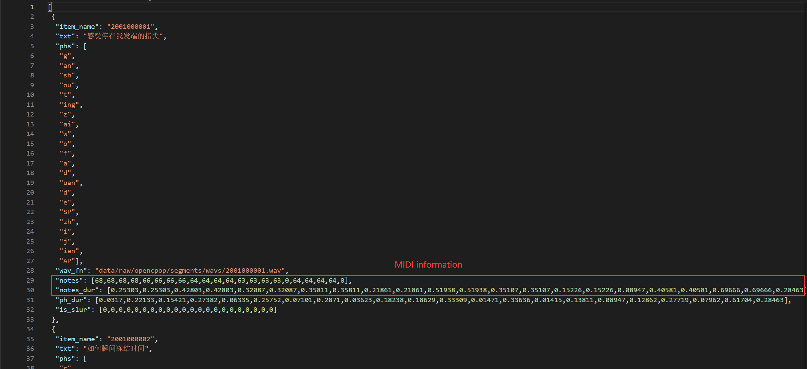

# DiffSinger: Singing Voice Synthesis via Shallow Diffusion Mechanism
[](https://arxiv.org/abs/2105.02446)
[](https://github.com/MoonInTheRiver/DiffSinger)

## DiffSinger (MIDI version SVS)
- First, we tend to remind you that MIDI version is not included in the content of our AAAI paper. The camera-ready version of the paper won't be changed. Thus, the authors make no warranties regarding this part of codes/experiments.
- Second, there are many differences of model structure, especially in the **melody frontend**. 
- Third, thanks [Opencpop team](https://wenet.org.cn/opencpop/) for releasing their SVS dataset with MIDI label, **Jan.20, 2022**. (Also thanks to my co-author [Yi Ren](https://github.com/RayeRen), who applied for the dataset and did some preprocessing works for this part)

### 0. Data Acquirement
a) For PopCS dataset: WIP. We may release the MIDI label of PopCS in the future, and update this part. 

b) For Opencpop dataset: Please strictly follow the instructions of [Opencpop](https://wenet.org.cn/opencpop/). We have no right to give you the access to Opencpop.

The pipeline below is designed for Opencpop dataset:

### 1. Data Preparation
a) Download and extract Opencpop, then create a link to the dataset folder: `ln -s /xxx/opencpop data/raw/`

b) Create `meta.json` in `opencpop/segments` according to the information in `opencpop/segments/transcriptions.txt`
<table style="width:100%">
  <tr>
    <th>example of meta.json (a big *list* of *dict*s)</th>
  </tr>
  <tr>
    <td></td>
  </tr>
</table>

c) Run the following scripts to pack the dataset for training/inference.
```sh
export PYTHONPATH=.
CUDA_VISIBLE_DEVICES=0 python data_gen/tts/bin/binarize.py --config usr/configs/midi/cascade/opencs/opencpop_aux.yaml
# `data/binary/opencpop-midi-cascade` will be generated.
```

### 2. Training Example
```sh
CUDA_VISIBLE_DEVICES=0 python tasks/run.py --config usr/configs/midi/cascade/opencs/opencpop_ds58.yaml --exp_name 0128_opencpop_ds58_midi --reset  
# or CUDA_VISIBLE_DEVICES=0 python tasks/run.py --config usr/configs/midi/cascade/opencs/opencpop_ds100.yaml --exp_name 0128_opencpop_ds_naive_midi --reset
```

### 3. Inference Example
```sh
CUDA_VISIBLE_DEVICES=0 python tasks/run.py --config usr/configs/midi/cascade/opencs/opencpop_ds58.yaml --exp_name 0128_opencpop_ds58_midi --reset --infer
# or CUDA_VISIBLE_DEVICES=0 python tasks/run.py --config usr/configs/midi/cascade/opencs/opencpop_ds100.yaml --exp_name 0128_opencpop_ds_naive_midi --reset --infer
```

We also provide:
 - the pre-trained model of [DiffSinger](https://github.com/MoonInTheRiver/DiffSinger/releases/download/pretrain-model/0128_opencpop_ds58_midi.zip);
 - the pre-trained model of [FFT-Singer](https://github.com/MoonInTheRiver/DiffSinger/releases/download/pretrain-model/0126_opencpop_fs_midi.zip);
 - the pre-trained model of [HifiGAN-Singing](https://github.com/MoonInTheRiver/DiffSinger/releases/download/pretrain-model/0109_hifigan_bigpopcs_hop128.zip) which is specially designed for SVS with NSF mechanism, and you can replace the original checkpoint file by [MoreTrainingStepsCKPT](https://github.com/MoonInTheRiver/DiffSinger/releases/download/pretrain-model/model_ckpt_steps_1512000.ckpt).
 - the pre-trained model of [DiffSinger Naive](https://github.com/MoonInTheRiver/DiffSinger/releases/download/pretrain-model/0128_opencpop_ds_naive_midi.zip);

Please unzip the [HifiGAN-Singing](https://github.com/MoonInTheRiver/DiffSinger/releases/download/pretrain-model/0109_hifigan_bigpopcs_hop128.zip) and [FFT-Singer](https://github.com/MoonInTheRiver/DiffSinger/releases/download/pretrain-model/0126_opencpop_fs_midi.zip) before training your new model.

### 4. Some issues.
a) the [HifiGAN-Singing](https://github.com/MoonInTheRiver/DiffSinger/releases/download/pretrain-model/0109_hifigan_bigpopcs_hop128.zip) is trained on our [vocoder dataset](https://dl.acm.org/doi/abs/10.1145/3474085.3475437) and the training set of [PopCS](https://arxiv.org/abs/2105.02446). Opencpop is the out-of-domain dataset (unseen speaker). This may cause the deterioration of audio quality, and we are considering fine-tuning this vocoder on the training set of Opencpop.

b) in this version of codes, we used the melody frontend ([lyric + MIDI]->[F0]) to predict F0 contour, but used the ground truth ph-durations.

c) the generated audio demos can be found in [DiffSinger](https://github.com/MoonInTheRiver/DiffSinger/releases/download/pretrain-model/0128_opencpop_ds58_midi.zip) or [DiffSinger Naive](https://github.com/MoonInTheRiver/DiffSinger/releases/download/pretrain-model/0128_opencpop_ds_naive_midi.zip).
